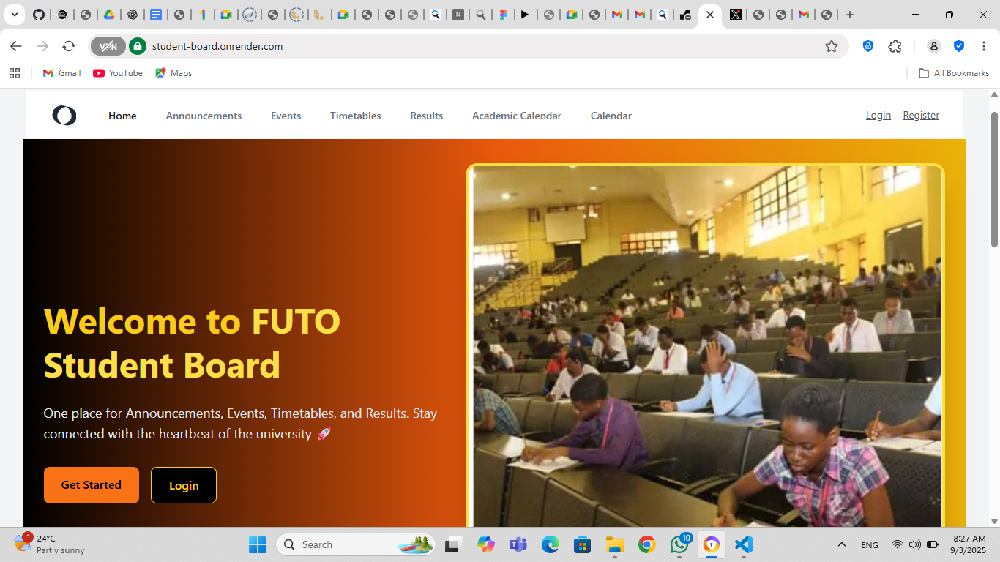
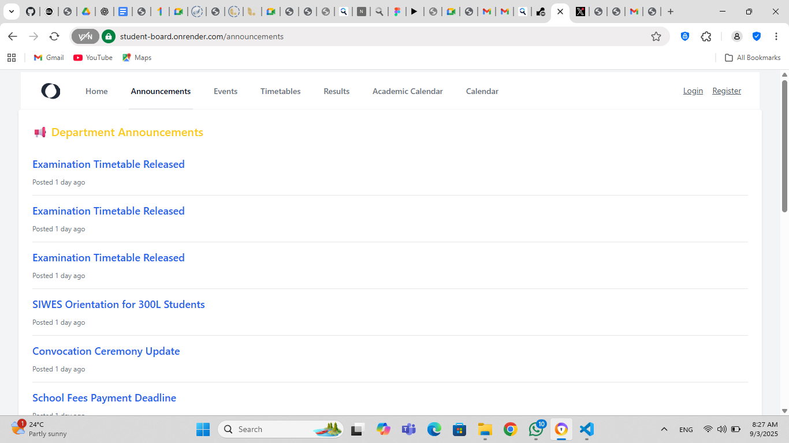
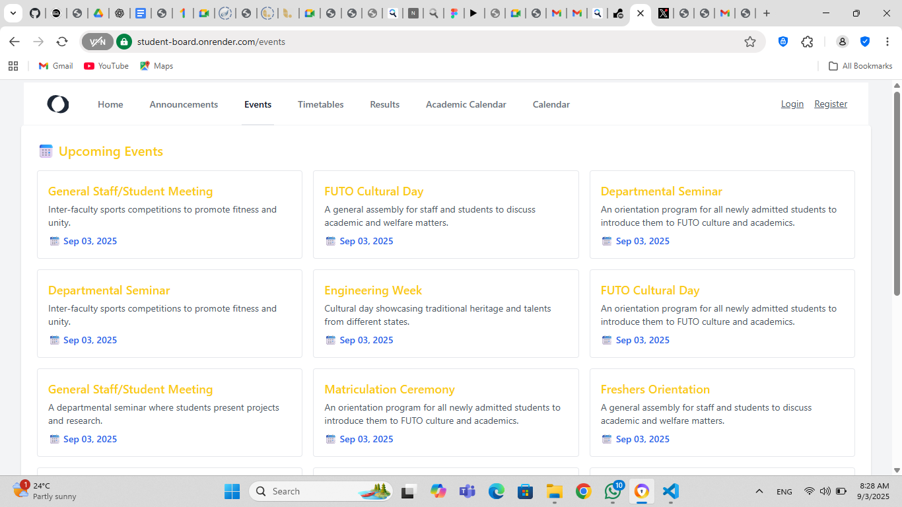
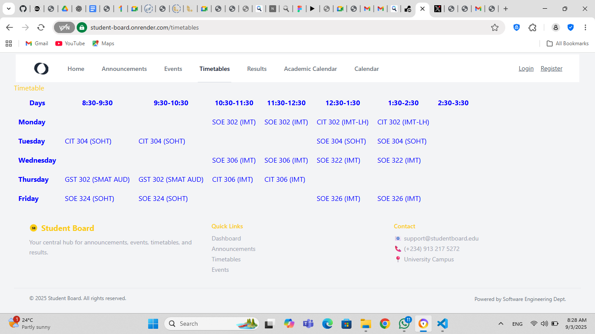
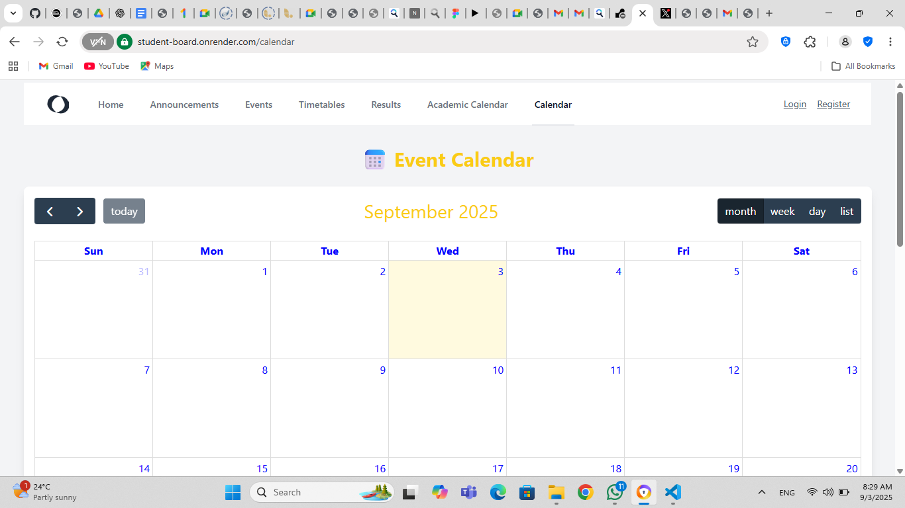

# 🎓 Student Board

Student Board is a Laravel-based web application designed as a **central hub for students** to stay updated with:
- 📢 Announcements  
- 📅 Events (with calendar & archives)  
- 📖 Timetables  
- 📝 Results  
- 📚 Academic Calendar  

It provides a clean, responsive interface and supports authentication for students and admins.  

---

## 🚀 Features

- **Authentication** (Laravel Breeze / Jetstream style)  
- **Announcements** with archive & search filter  
- **Events** with full calendar view, event archive & feed  
- **Academic Calendar** with year-based image selection (2020–2025)  
- **Timetables** (per course/department)  
- **Results management** (accessible to logged-in students)  
- **Responsive UI** with Tailwind CSS  
- **Professional footer & navigation**  
- **Hosted on Render** with PostgreSQL  

---

## 🛠️ Tech Stack

- **Backend**: [Laravel 10](https://laravel.com/) (PHP 8.1)  
- **Frontend**: [Blade Templates](https://laravel.com/docs/blade) + [TailwindCSS](https://tailwindcss.com/)  
- **Database**: PostgreSQL (hosted on Render)  
- **Authentication**: Laravel Breeze / Jetstream  
- **Deployment**: [Render](https://render.com/)  
- **Version Control**: Git & GitHub  

---

## 📂 Project Structure

student-board/
│── app/ # Controllers, Models, Policies
│── database/ # Migrations, Seeders, Factories
│── resources/
│ ├── views/ # Blade templates
│ ├── images/academic # Academic calendar images
│── routes/
│ └── web.php # Web routes
│── public/ # Public assets
│── README.md # Project documentation


---

## ⚙️ Installation

Clone the repository and install dependencies:

```bash
git clone https://github.com/onyedika-glitch/student-board.git
cd student-board
composer install
npm install && npm run dev

Copy .env file and update database credentials:
cp .env.example .env

generate an application key: php artisan key:generate

Run migrations and seeders:
php artisan migrate --seed

Start the development server:
php artisan serve
```
Testing

Unit & Feature Tests: Run with
php artisan test

Integration Tests: Run with
php artisan dusk

Manual Testing:

Check announcements archive search

Check event archive & calendar

Verify timetable rendering

Verify academic calendar year filtering

Test authentication (login/register/profile/logout)

📦 Deployment (Render)

Push project to GitHub.

Create a Render Web Service → select Laravel app.

Add a PostgreSQL Database in Render and update .env.

Set build command:
composer install && php artisan migrate --force
npm install && npm run build

Set start command: php artisan serve --port=$PORT
Set environment variables from .env.
Deploy and access your deployed app at the provided URL!








✨ Future Improvements

Add notifications system (email/SMS)

Role-based dashboard (Admins vs Students)

API endpoints for mobile app integration

Improved search with Livewire or Vue.js

👨‍💻 Contributors

Omogo Peter Onyedika – Project Owner & Developer

Dept. of Software Engineering (University Project)

📜 License

This project is licensed under the MIT License.
